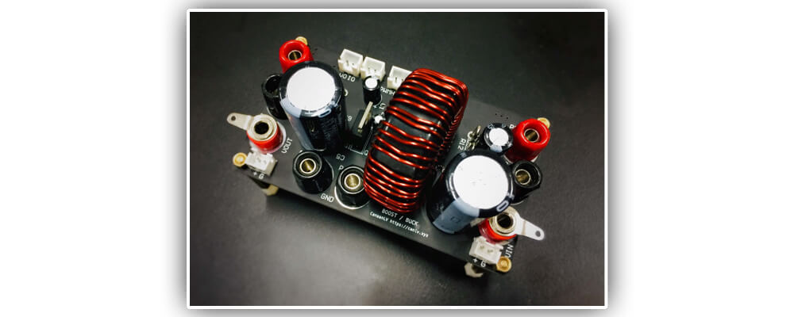
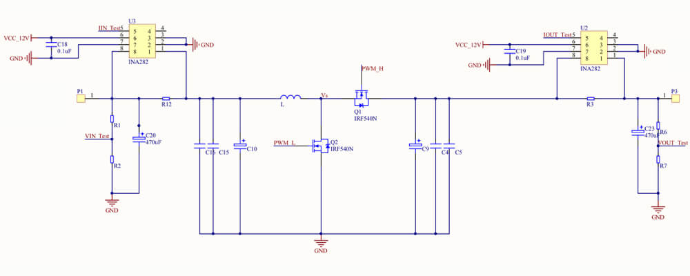
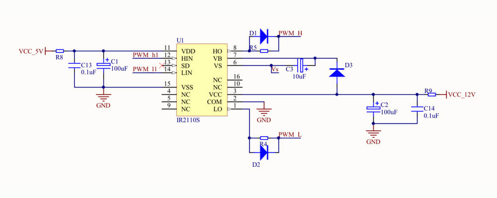

双向DC-DC升压与降压变换器模块

-------

   

For English version [English Documentation](../README.md).

# 模块描述

双向DC-DC升压与降压变换器在满足基础升压与降压功能的基础上，拓展了多种附属电路与功能。还能够维持较高的工作效率。

# 功能特性

模块具备以下功能特性：

- 模块支持PWM、SPWM等控制信号
- 使用同步整流大幅提升效率，两只开关管可单独控制
- MOSFIT管基极具有电荷释放电路，防止电荷积累击穿MOS管。
- 在输入与输出端口留有电压与电流采样电路。
- 输入与输出预留万用表探测接口，方便测试。
- 驱动电阻方便更换调整。
- 关键供电点设置有低通滤波器电路位置，不用时短接即可。
- 使用电阻更小的香蕉头接线柱。

**注意：此模块需要另外的12V与5V为内置芯片供电。**

# 数据参数

具体参数可参考下表：

**⚠️警告⚠️**
- 由于作者精力有限，峰值电压为推测值，未经过严格的可靠性测试。所以峰值电压不代表您可以在此条件下长时间正常工作。请保护好自己的安全！
- 建议典型值为作者实验与测试使用的数值，当您选择供电参数时，建议您查看元件的datasheet分析耐压值。

项目|峰值|建议典型值
:-|:-:|:-:
输入电压|0V～100V|10V～60V
输出电压|0V～100V|10V～60V
输入电流|0A～4A|0A～2A
输出电流|0A～4A|0A～2A
内置芯片供电电压|0V～12V|5V、12V
控制信号电压|0V～5V|5V、3.3V

# 元件需求

本模块需要以下芯片与晶体管（常用电子元件以及封装请查看工程文档）：

- IRF540N
- IR2110S
- 电感
- INA282

# 电路分析与注意事项

## 升压与降压主电路

电路下图所示：

R3与R12为康铜丝（采样电阻），采取电流大小，INA282对采样电阻两端的电压放大倍数为50倍，请酌情选择阻值。典型值为20毫欧。

输入与输出并联与地的电容请根据实际的滤波情况进行选择，不宜太大，因为太大的电容势必会造成更多的电荷损失，增加系统损耗。

R1、R2、R6、R7为电阻分压采样，其电压公式为：

其他同理。

电感的感值与承受的功率一般限制模块的最大工作功率，可以通过最大占空比、最大功率和频率计算。建议选取比计算值稍大的电感。

**注意：电感的选用与模块工作的状态有关，需要了解的是，电感的感值与频率成反比。不建议选用太大的电感，因为会产生更多的漏磁现象，降低工作效率。**

模块输入电压与输出电压的耐压值受制于电解电容的耐压值。但是尽量不要超过240V。

## 驱动控制电路

电路图如下：

此电路中，C3自举电容的作用将成为理解电路的关键。自举电容就是在低端管开通时充电积攒电压；在高端管将要开通时，将积攒的电压叠加在源极上传输给基极，实现高端管的开通。此电容的容值不必很大，使用钽电容也可达到同样的效果。

驱动电阻R4、R5建议选用10欧姆以内的电阻，以降低回路中的振铃幅度。作者使用的典型值为2.2欧姆。

**注意：由于使用同步整流电路，两路控制信号请务必加入死区，切勿另两路同时开通，导致电路烧坏。**

# 软件支持

您可以使用各类MCU、FPGA，生成驱动能力较强的PWM、SPWM波形，为模块提供控制信号。建议添加光耦隔离对主控进行保护。

作者使用STM32F407最小系统板，利用内置时钟直接生成PWM波供给模块，亦可应付大部分应用场景。

# 版本更新

- v2.1 黑色版本。
- v2.0 第二次打样。
- v1.0 第一次打样。

# License

本作品遵循MIT开源协议。您可以自由的再创作，但必须注明本作者。